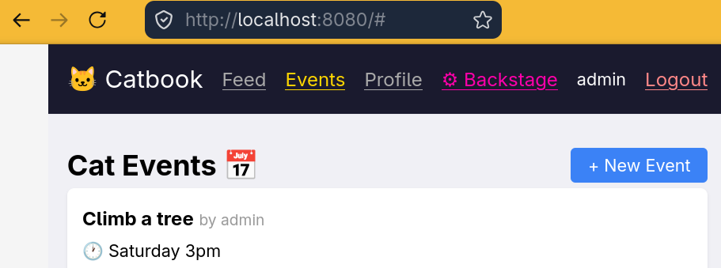

# Catbook

An example application for Algernon, using Teal, React 19 and Just.

Try it out by having the latest (development / main) version of Algernon installed, as well as `just` and then just run:

    just

Or, if you don't want to install and use `just`, just run:

     algernon -n --domain -t -a :8080

And then open http://localhost:8080 in a browser.

Then, for example:

* Register a user named `bob` with password `bob` and email `bob@zombo.com`, then log in with `bob`/`bob` and poke around.
* Register a user named `admin` and log in with that user to get access to the "backstage" area, where you can see all registered users.

Note that this is meant to be an example application for Algernon and a start that can be built upon, and not a full and feature complete web application.

### General info

* Version: 0.0.1
* License: MIT
